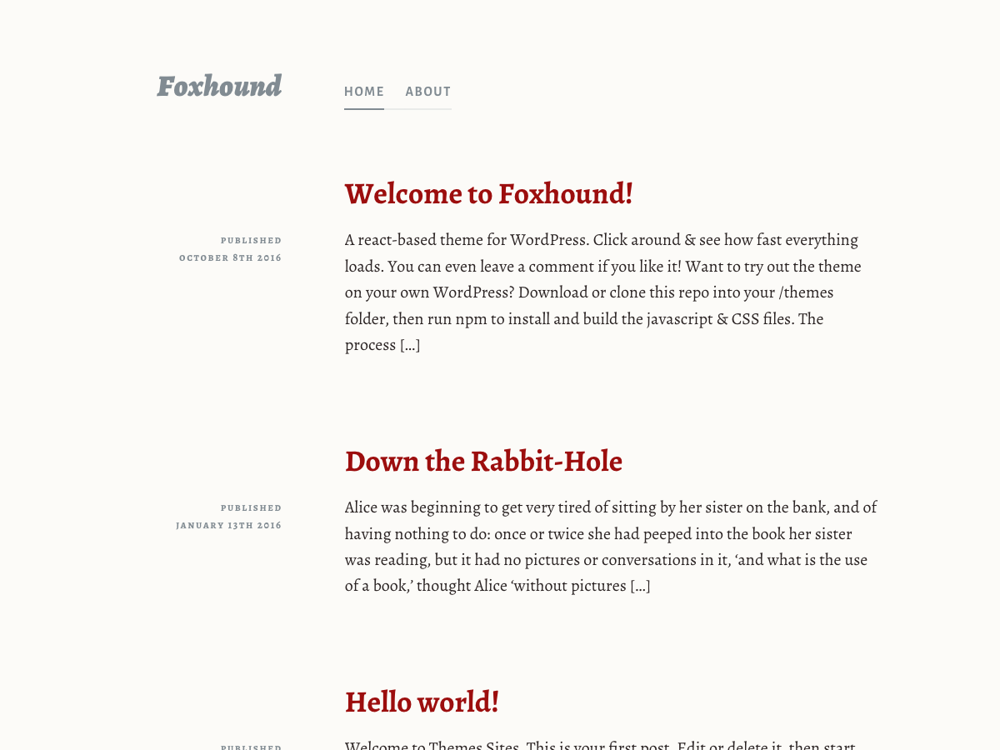

Foxhound 
========

A react-based theme for WordPress.

Setup
-----

Since this is a more "experimental" theme, you'll need to have a few things set up before it'll work.

1. WordPress 4.7 or higher, which includes the REST API content endpoints.
2. You'll also need this [WP-API Menus plugin](https://wordpress.org/plugins/wp-api-menus/). The REST API doesn't provide an endpoint for menus, so another plugin is necessary.
3. Your permalinks will need to be set to `/%year%/%monthnum%/%postname%/`. Single-post/page views will not work without permalinks set. Category & tag archives bases should be set to `category` and `tag`, respectively.

Display & Features
------------------

This theme supports your average blogging site. It looks best with "Front page displays" set to latest posts (in Settings > Reading), however it does support a static page & blog posts on another page. This theme works best for very text-focused sites. It will display featured images on single posts & pages, but not on archive/list views. There is currently no special handling for post formats.

Restrictions
------------

This theme does have a few "restrictions", things that don't work like they do in other WordPress themes.

The theme does not display anything if javascript is disabled. This should not affect your SEO, [as google will crawl your page with JS & CSS enabled](https://webmasters.googleblog.com/2014/10/updating-our-technical-webmaster.html). This should not affect accessibility ([99% of screen reader users have javascript enabled, in 2012](http://webaim.org/projects/screenreadersurvey4/#javascript)). However, if your site needs to be usable without javascript, a javascript theme is not your best choice 😉

The API cannot be blocked by a security plugin. Some plugins recommend blocking the users endpoint, but that is required to show the author archive. If you _need_ to block the user endpoint, the rest of the theme should work, but might be unstable if anyone tries to visit an author archive.

Permalinks for pages and archives _are changed_ by this theme. They'll be reset if/when you deactivate the theme. You might want to set up redirects using something like [Safe Redirect Manager](https://wordpress.org/plugins/safe-redirect-manager/).

This theme does not support hierarchical category archives - only parent category archive pages can be displayed. This may be fixed in a later version of the theme (see [#30](https://github.com/ryelle/Foxhound/issues/30)).

Plugins might not work as expected, especially if they add content to the front end of your site. Most Jetpack features _do_ still work.

Thanks to…
----------

These are a few of the packages/plugins that made this theme possible.

- [WP-API](http://v2.wp-api.org/)
- [WP API Menus Plugin](https://wordpress.org/plugins/wp-api-menus/)
- [node-wpapi](https://www.npmjs.com/package/wpapi)
- [wordpress-rest-api-oauth-1](https://www.npmjs.com/package/wordpress-rest-api-oauth-1)
- [react-document-meta](https://www.npmjs.com/package/react-document-meta)
- [react-router-scroll](https://www.npmjs.com/package/react-router-scroll)
- & of course, [Mel Choyce](https://choycedesign.com) for designing all the things.

Development
-----------

You can also install Foxhound yourself from this repo, by building it yourself. Download or clone this repo into your `/themes` folder, then run npm to install and build the javascript & CSS files. The process will look like this

	git clone https://github.com/ryelle/Foxhound foxhound
	cd foxhound
	npm install
	npm run build

Now you'll see a `build/app.js` file in the theme, and it will be available for you to switch to in wp-admin. If you're having trouble getting the theme active, please [file an issue](https://github.com/ryelle/Foxhound/issues) & I'll help you out.

_If you don't have npm installed, you can find instructions on [the npm website](http://npmjs.com)._

There are a few other NPM scripts you can run:

`npm run dev` runs `webpack`, with configuration enabling source maps. Eventually `build` will also compress/uglify built files, so this would skip that too (but that's currently disabled).

`npm run watch` runs `webpack --watch`, everything the previous command but it will also watch the source files for changes and recompile automatically. Best to run while developing. This *does not* live reload.

`npm run lint` runs `eslint` over all the javascript files. Webpack does this as well, before compiling, but only notifies you of errors. This command will catch warnings too.

On the PHP side, we're also adding in some prefixes for permalinks (also called routes).

Support
-------

If you notice anything broken (that isn't mentioned in the "restrictions" section), [let me know by creating an issue](https://github.com/ryelle/Foxhound/issues).

Thanks for checking out Foxhound!
